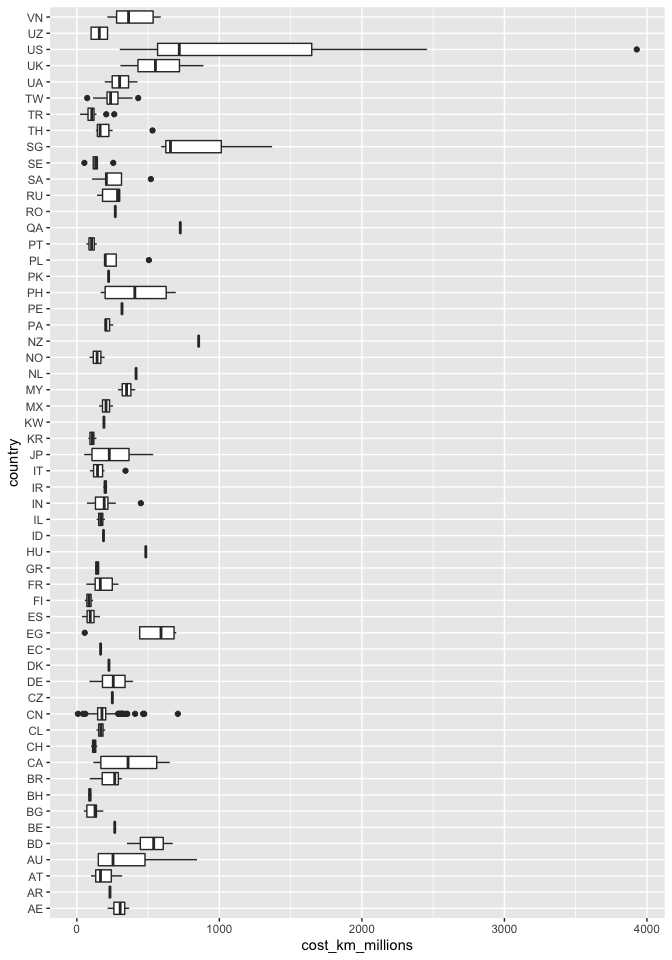
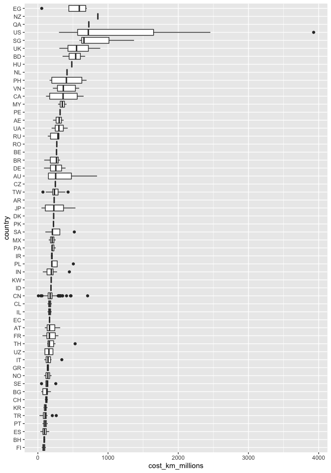

R-Ladies DC: Tidy Tuesday
================
2021-01-05

``` r
library(tidyverse)
# getting the data from the web
# transit_cost <- readr::read_csv('https://raw.githubusercontent.com/rfordatascience/tidytuesday/master/data/2021/2021-01-05/transit_cost.csv')

# if you have it downloaded
transit_cost <- read_csv("transit_cost.csv")
```

``` r
skimr::skim(transit_cost)
```

|                                                  |               |
|:-------------------------------------------------|:--------------|
| Name                                             | transit\_cost |
| Number of rows                                   | 544           |
| Number of columns                                | 20            |
| \_\_\_\_\_\_\_\_\_\_\_\_\_\_\_\_\_\_\_\_\_\_\_   |               |
| Column type frequency:                           |               |
| character                                        | 11            |
| numeric                                          | 9             |
| \_\_\_\_\_\_\_\_\_\_\_\_\_\_\_\_\_\_\_\_\_\_\_\_ |               |
| Group variables                                  | None          |

Data summary

**Variable type: character**

| skim\_variable | n\_missing | complete\_rate | min | max | empty | n\_unique | whitespace |
|:---------------|-----------:|---------------:|----:|----:|------:|----------:|-----------:|
| country        |          7 |           0.99 |   2 |   2 |     0 |        56 |          0 |
| city           |          7 |           0.99 |   4 |  16 |     0 |       140 |          0 |
| line           |          7 |           0.99 |   2 |  46 |     0 |       366 |          0 |
| start\_year    |         53 |           0.90 |   4 |   9 |     0 |        40 |          0 |
| end\_year      |         71 |           0.87 |   1 |   4 |     0 |        36 |          0 |
| tunnel\_per    |         32 |           0.94 |   5 |   7 |     0 |       134 |          0 |
| source1        |         12 |           0.98 |   4 |  54 |     0 |        17 |          0 |
| currency       |          7 |           0.99 |   2 |   3 |     0 |        39 |          0 |
| real\_cost     |          0 |           1.00 |   1 |  10 |     0 |       534 |          0 |
| source2        |         10 |           0.98 |   3 |  16 |     0 |        12 |          0 |
| reference      |         19 |           0.97 |   3 | 302 |     0 |       350 |          0 |

**Variable type: numeric**

| skim\_variable     | n\_missing | complete\_rate |      mean |         sd |      p0 |     p25 |      p50 |      p75 |        p100 | hist  |
|:-------------------|-----------:|---------------:|----------:|-----------:|--------:|--------:|---------:|---------:|------------:|:------|
| e                  |          7 |           0.99 |   7738.76 |     463.23 | 7136.00 | 7403.00 |  7705.00 |  7977.00 |     9510.00 | ▇▇▂▁▁ |
| rr                 |          8 |           0.99 |      0.06 |       0.24 |    0.00 |    0.00 |     0.00 |     0.00 |        1.00 | ▇▁▁▁▁ |
| length             |          5 |           0.99 |     58.34 |     621.20 |    0.60 |    6.50 |    15.77 |    29.08 |    12256.98 | ▇▁▁▁▁ |
| tunnel             |         32 |           0.94 |     29.38 |     344.04 |    0.00 |    3.40 |     8.91 |    21.52 |     7790.78 | ▇▁▁▁▁ |
| stations           |         15 |           0.97 |     13.81 |      13.70 |    0.00 |    4.00 |    10.00 |    20.00 |      128.00 | ▇▁▁▁▁ |
| cost               |          7 |           0.99 | 805438.12 | 6708033.07 |    0.00 | 2289.00 | 11000.00 | 27000.00 | 90000000.00 | ▇▁▁▁▁ |
| year               |          7 |           0.99 |   2014.91 |       5.64 | 1987.00 | 2012.00 |  2016.00 |  2019.00 |     2027.00 | ▁▁▂▇▂ |
| ppp\_rate          |          9 |           0.98 |      0.66 |       0.87 |    0.00 |    0.24 |     0.26 |     1.00 |        5.00 | ▇▂▁▁▁ |
| cost\_km\_millions |          2 |           1.00 |    232.98 |     257.22 |    7.79 |  134.86 |   181.25 |   241.43 |     3928.57 | ▇▁▁▁▁ |

``` r
# another way to do this: ktable?
```

``` r
glimpse(transit_cost)
```

    ## Rows: 544
    ## Columns: 20
    ## $ e                <dbl> 7136, 7137, 7138, 7139, 7144, 7145, 7146, 7147, 7152…
    ## $ country          <chr> "CA", "CA", "CA", "CA", "CA", "NL", "CA", "US", "US"…
    ## $ city             <chr> "Vancouver", "Toronto", "Toronto", "Toronto", "Toron…
    ## $ line             <chr> "Broadway", "Vaughan", "Scarborough", "Ontario", "Yo…
    ## $ start_year       <chr> "2020", "2009", "2020", "2020", "2020", "2003", "202…
    ## $ end_year         <chr> "2025", "2017", "2030", "2030", "2030", "2018", "202…
    ## $ rr               <dbl> 0, 0, 0, 0, 0, 0, 0, 0, 0, 0, 0, 0, 0, 0, 0, 0, 0, 0…
    ## $ length           <dbl> 5.7, 8.6, 7.8, 15.5, 7.4, 9.7, 5.8, 5.1, 4.2, 4.2, 6…
    ## $ tunnel_per       <chr> "87.72%", "100.00%", "100.00%", "57.00%", "100.00%",…
    ## $ tunnel           <dbl> 5.0, 8.6, 7.8, 8.8, 7.4, 7.1, 5.8, 5.1, 4.2, 4.2, 6.…
    ## $ stations         <dbl> 6, 6, 3, 15, 6, 8, 5, 2, 2, 2, 3, 3, 4, 7, 13, 4, 4,…
    ## $ source1          <chr> "Plan", "Media", "Wiki", "Plan", "Plan", "Wiki", "Me…
    ## $ cost             <dbl> 2830, 3200, 5500, 8573, 5600, 3100, 4500, 1756, 3600…
    ## $ currency         <chr> "CAD", "CAD", "CAD", "CAD", "CAD", "EUR", "CAD", "US…
    ## $ year             <dbl> 2018, 2013, 2018, 2019, 2020, 2009, 2018, 2012, 2023…
    ## $ ppp_rate         <dbl> 0.840, 0.810, 0.840, 0.840, 0.840, 1.300, 0.840, 1.0…
    ## $ real_cost        <chr> "2377.2", "2592", "4620", "7201.32", "4704", "4030",…
    ## $ cost_km_millions <dbl> 417.05263, 301.39535, 592.30769, 464.60129, 635.6756…
    ## $ source2          <chr> "Media", "Media", "Media", "Plan", "Media", "Media",…
    ## $ reference        <chr> "https://www.translink.ca/Plans-and-Projects/Rapid-T…

## Cleaning data

``` r
transit_cost %>% 
  mutate(real_cost = parse_number(real_cost)) %>% 
  glimpse()
```

    ## Warning: Problem with `mutate()` input `real_cost`.
    ## ℹ 5 parsing failures.
    ## row col expected actual
    ## 538  -- a number AVG   
    ## 539  -- a number MEDIAN
    ## 540  -- a number STD   
    ## 541  -- a number MIN   
    ## 544  -- a number N     
    ## 
    ## ℹ Input `real_cost` is `parse_number(real_cost)`.

    ## Warning: 5 parsing failures.
    ## row col expected actual
    ## 538  -- a number AVG   
    ## 539  -- a number MEDIAN
    ## 540  -- a number STD   
    ## 541  -- a number MIN   
    ## 544  -- a number N

    ## Rows: 544
    ## Columns: 20
    ## $ e                <dbl> 7136, 7137, 7138, 7139, 7144, 7145, 7146, 7147, 7152…
    ## $ country          <chr> "CA", "CA", "CA", "CA", "CA", "NL", "CA", "US", "US"…
    ## $ city             <chr> "Vancouver", "Toronto", "Toronto", "Toronto", "Toron…
    ## $ line             <chr> "Broadway", "Vaughan", "Scarborough", "Ontario", "Yo…
    ## $ start_year       <chr> "2020", "2009", "2020", "2020", "2020", "2003", "202…
    ## $ end_year         <chr> "2025", "2017", "2030", "2030", "2030", "2018", "202…
    ## $ rr               <dbl> 0, 0, 0, 0, 0, 0, 0, 0, 0, 0, 0, 0, 0, 0, 0, 0, 0, 0…
    ## $ length           <dbl> 5.7, 8.6, 7.8, 15.5, 7.4, 9.7, 5.8, 5.1, 4.2, 4.2, 6…
    ## $ tunnel_per       <chr> "87.72%", "100.00%", "100.00%", "57.00%", "100.00%",…
    ## $ tunnel           <dbl> 5.0, 8.6, 7.8, 8.8, 7.4, 7.1, 5.8, 5.1, 4.2, 4.2, 6.…
    ## $ stations         <dbl> 6, 6, 3, 15, 6, 8, 5, 2, 2, 2, 3, 3, 4, 7, 13, 4, 4,…
    ## $ source1          <chr> "Plan", "Media", "Wiki", "Plan", "Plan", "Wiki", "Me…
    ## $ cost             <dbl> 2830, 3200, 5500, 8573, 5600, 3100, 4500, 1756, 3600…
    ## $ currency         <chr> "CAD", "CAD", "CAD", "CAD", "CAD", "EUR", "CAD", "US…
    ## $ year             <dbl> 2018, 2013, 2018, 2019, 2020, 2009, 2018, 2012, 2023…
    ## $ ppp_rate         <dbl> 0.840, 0.810, 0.840, 0.840, 0.840, 1.300, 0.840, 1.0…
    ## $ real_cost        <dbl> 2377.200, 2592.000, 4620.000, 7201.320, 4704.000, 40…
    ## $ cost_km_millions <dbl> 417.05263, 301.39535, 592.30769, 464.60129, 635.6756…
    ## $ source2          <chr> "Media", "Media", "Media", "Plan", "Media", "Media",…
    ## $ reference        <chr> "https://www.translink.ca/Plans-and-Projects/Rapid-T…

``` r
transit_cost %>% 
  tail(10)
```

    ## # A tibble: 10 x 20
    ##        e country city  line  start_year end_year    rr  length tunnel_per tunnel
    ##    <dbl> <chr>   <chr> <chr> <chr>      <chr>    <dbl>   <dbl> <chr>       <dbl>
    ##  1  9510 TR      Ista… M11 … 2019       2022         0    32   100.00%      32  
    ##  2  9459 UZ      Tash… Serg… 2017       2020         0     7.1 0.00%         7.1
    ##  3  9460 UZ      Tash… Yunu… 2017       2020         0     2.9 100.00%       2.9
    ##  4    NA <NA>    <NA>  <NA>  <NA>       <NA>        NA 12257.  <NA>       7791. 
    ##  5    NA <NA>    <NA>  <NA>  <NA>       <NA>        NA  7661.  <NA>         NA  
    ##  6    NA <NA>    <NA>  <NA>  <NA>       <NA>        NA    NA   <NA>         NA  
    ##  7    NA <NA>    <NA>  <NA>  <NA>       <NA>        NA    NA   <NA>         NA  
    ##  8    NA <NA>    <NA>  <NA>  <NA>       <NA>        NA    NA   <NA>         NA  
    ##  9    NA <NA>    <NA>  <NA>  <NA>       <NA>        NA    NA   <NA>         NA  
    ## 10    NA <NA>    <NA>  <NA>  <NA>       <NA>        NA    NA   <NA>         NA  
    ## # … with 10 more variables: stations <dbl>, source1 <chr>, cost <dbl>,
    ## #   currency <chr>, year <dbl>, ppp_rate <dbl>, real_cost <chr>,
    ## #   cost_km_millions <dbl>, source2 <chr>, reference <chr>

``` r
transit_cost <- transit_cost %>% 
  filter(!is.na(e))
```

``` r
transit_cost <- transit_cost %>% 
  mutate(across(.cols = c(start_year, end_year, tunnel_per,
                          real_cost), parse_number))
```

    ## Warning: Problem with `mutate()` input `..1`.
    ## ℹ 10 parsing failures.
    ## row col expected    actual
    ## 273  -- a number not start
    ## 276  -- a number not start
    ## 277  -- a number not start
    ## 279  -- a number not start
    ## 286  -- a number not start
    ## ... ... ........ .........
    ## See problems(...) for more details.
    ## 
    ## ℹ Input `..1` is `across(...)`.

    ## Warning: 10 parsing failures.
    ## row col expected    actual
    ## 273  -- a number not start
    ## 276  -- a number not start
    ## 277  -- a number not start
    ## 279  -- a number not start
    ## 286  -- a number not start
    ## ... ... ........ .........
    ## See problems(...) for more details.

    ## Warning: Problem with `mutate()` input `..1`.
    ## ℹ 3 parsing failures.
    ## row col expected actual
    ## 506  -- a number      X
    ## 515  -- a number      X
    ## 516  -- a number      X
    ## 
    ## ℹ Input `..1` is `across(...)`.

    ## Warning: 3 parsing failures.
    ## row col expected actual
    ## 506  -- a number      X
    ## 515  -- a number      X
    ## 516  -- a number      X

## Summaries By Country

``` r
# total cost 
transit_cost %>% 
  group_by(country) %>%
  summarise(mean_cost = mean(real_cost, na.rm = T)) %>% 
  arrange(mean_cost) %>% 
  slice(1:5)
```

    ## # A tibble: 5 x 2
    ##   country mean_cost
    ##   <chr>       <dbl>
    ## 1 PT           341.
    ## 2 UZ           668.
    ## 3 DE           733.
    ## 4 CH           865.
    ## 5 NO           871.

``` r
transit_cost %>% 
  group_by(country) %>%
  summarise(mean_cost = mean(real_cost, na.rm = T)) %>% 
  arrange(desc(mean_cost)) %>% 
  slice(1:5)
```

    ## # A tibble: 5 x 2
    ##   country mean_cost
    ##   <chr>       <dbl>
    ## 1 QA         90000 
    ## 2 KW         30400 
    ## 3 SG         19504.
    ## 4 MY         18036.
    ## 5 SA         13545.

``` r
# cost per km of rail laid 
transit_cost %>% 
  group_by(country) %>%
  summarise(mean_cost = mean(cost_km_millions, na.rm = T)) %>% 
  arrange(mean_cost) %>% 
  slice(1:5)
```

    ## # A tibble: 5 x 2
    ##   country mean_cost
    ##   <chr>       <dbl>
    ## 1 FI           85.0
    ## 2 BH           91.2
    ## 3 ES           97.2
    ## 4 PT          104. 
    ## 5 KR          107.

``` r
transit_cost %>% 
  group_by(country) %>%
  summarise(mean_cost = mean(cost_km_millions, na.rm = T)) %>% 
  arrange(desc(mean_cost)) %>% 
  slice(1:5)
```

    ## # A tibble: 5 x 2
    ##   country mean_cost
    ##   <chr>       <dbl>
    ## 1 US          1211.
    ## 2 SG           873.
    ## 3 NZ           855.
    ## 4 QA           726.
    ## 5 UK           582.

``` r
transit_cost %>% 
  ggplot() + 
  geom_boxplot(aes(x = country, y = cost_km_millions)) + 
  coord_flip()
```

    ## Warning: Removed 2 rows containing non-finite values (stat_boxplot).



``` r
transit_cost %>% 
  mutate(country = as.factor(country),
         country = fct_reorder(country, cost_km_millions, 
                                   .fun = median)) %>% 
  ggplot() + 
  geom_boxplot(aes(x = country, 
                               y = cost_km_millions)) + 
  coord_flip()
```

    ## Warning: Removed 2 rows containing non-finite values (stat_boxplot).


