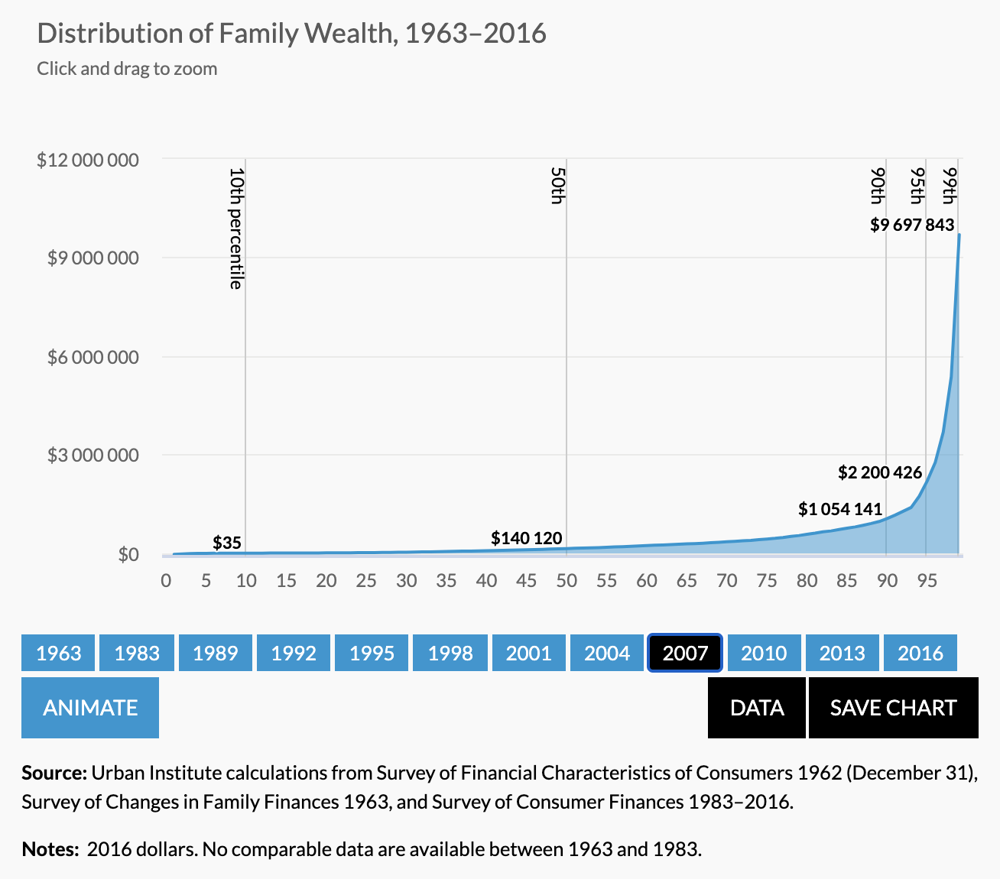
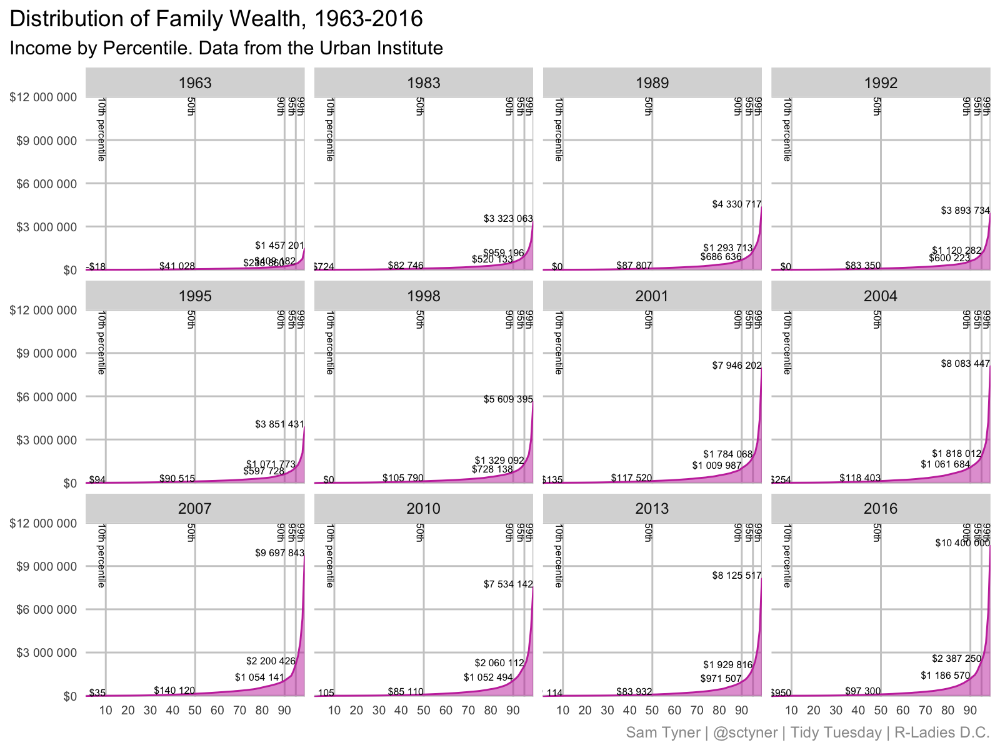
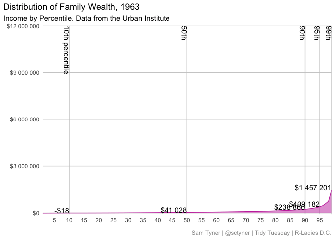

R-Ladies DC - Galentine’s Day!
================
Sam Tyner
2/13/2021

Load `tidyverse`

``` r
library(tidyverse)
```

## Distribution of Family Wealth, 1963-2016

Urban Institute’s figure:



Figure in R:

<!-- https://www.schemecolor.com/30-best-valentines-day-color-schemes.php -->

``` r
wealth <- readxl::read_excel("WealthDistribution.xlsx", skip = 1)
wealth %>% 
  rename(percentile = ...1) %>% 
  pivot_longer(-percentile, names_to = "year", "wealth") %>% 
  mutate(across(percentile:year, parse_number)) %>% 
  arrange(year, percentile) %>% 
  filter(!is.na(value)) -> wealth

wealth %>% 
  filter(percentile %in% c(10, 50, 90, 95, 99)) -> wealth_annotate

wealth_annotate <- wealth_annotate %>% 
  mutate(label = 
           case_when(percentile == 10 ~
                     glue::glue("{percentile}th percentile"),
                     TRUE ~ glue::glue("{percentile}th"))) 

  
ggplot() + 
  geom_vline(data = wealth_annotate, color = "grey80",
             aes(xintercept = percentile)) + 
  geom_area(data = wealth, 
            aes(x = percentile, y = value), 
            fill = "#c739ab", alpha = .5, color = "#c739ab") +
  geom_text(data = wealth_annotate,
            aes(x = percentile, y = 12e6, label = label),
             angle = 270, vjust = 1, hjust = 0, size = 2) +
  geom_text(data = wealth_annotate,
            aes(x = percentile, y = value, 
                label = scales::dollar(value, big.mark = " ")),
             vjust = 0, hjust = 1, size = 2) + 
  facet_wrap(~year) + 
  scale_x_continuous(breaks = seq(0,100,10))+
  scale_y_continuous(breaks = 0:4*3*1e6, n.breaks = 5,
                     labels = scales::dollar_format(big.mark = " ")) +
  coord_cartesian(expand = FALSE) + 
  labs(x = NULL, y = NULL, 
       title = "Distribution of Family Wealth, 1963-2016", 
       caption = "Sam Tyner | @sctyner | Tidy Tuesday | R-Ladies D.C.",
       subtitle = "Income by Percentile. Data from the Urban Institute") + 
  theme(panel.background = element_rect(fill = NA), 
        panel.grid.major.x = element_blank(), 
        panel.grid.major.y = element_line(color = "grey80"),
        axis.ticks = element_blank(), 
        plot.title.position = "plot", 
        plot.caption = element_text(color = "grey60"),
        axis.text = element_text(size = 7))
```



## Animated

``` r
library(gganimate)

ggplot() + 
  geom_vline(data = wealth_annotate, color = "grey80",
             aes(xintercept = percentile)) + 
  geom_area(data = wealth, 
            aes(x = percentile, y = value), 
            fill = "#c739ab", alpha = .5, color = "#c739ab") +
  geom_text(data = wealth_annotate,
            aes(x = percentile, y = 12e6, label = label),
             angle = 270, vjust = 1, hjust = 0) +
  geom_text(data = wealth_annotate,
            aes(x = percentile, y = value, 
                label = scales::dollar(value, big.mark = " ")),
             vjust = 0, hjust = 1) + 
  scale_x_continuous(breaks = seq(0,95,5))+
  scale_y_continuous(breaks = 0:4*3*1e6, n.breaks = 5,
                     labels = scales::dollar_format(big.mark = " ")) +
  coord_cartesian(expand = FALSE) + 
  transition_states(year, transition_length = 1, state_length = 3) + 
  labs(x = NULL, y = NULL, 
       title = "Distribution of Family Wealth, {closest_state}", 
       caption = "Sam Tyner | @sctyner | Tidy Tuesday | R-Ladies D.C.",
       subtitle = "Income by Percentile. Data from the Urban Institute") + 
  theme(panel.background = element_rect(fill = NA), 
        panel.grid.major.x = element_blank(), 
        panel.grid.major.y = element_line(color = "grey80"),
        axis.ticks = element_blank(), 
        plot.title.position = "plot", 
        plot.caption = element_text(color = "grey60"))
```


