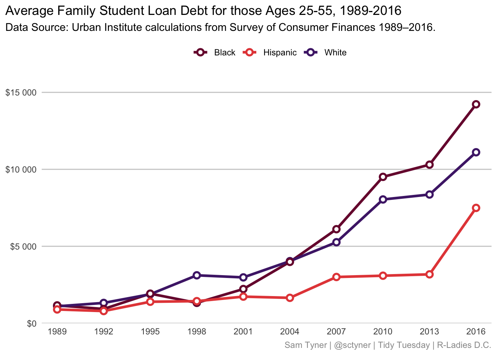

R-Ladies DC - Galentine’s Day!
================
Sam Tyner
2/13/2021

Load `tidyverse`

``` r
library(tidyverse)
```

## Distribution of Family Wealth, 1963-2016

(Prepared before event)

Urban Institute’s figure:


Figure in R:

<!-- https://www.schemecolor.com/30-best-valentines-day-color-schemes.php -->

``` r
# get the file if you don't have it already from github. 
# download it into your current working directory
# download.file("https://github.com/rfordatascience/tidytuesday/blob/master/data/2021/2021-02-09/WealthDistribution.xlsx?raw=true", destfile = "WealthDistribution.xlsx")

wealth <- readxl::read_excel("WealthDistribution.xlsx", skip = 1)

wealth %>% 
  rename(percentile = ...1) %>% 
  pivot_longer(-percentile, names_to = "year", 
               values_to = "wealth") %>% 
  mutate(across(percentile:year, parse_number)) %>% 
  filter(!is.na(wealth)) %>% 
  arrange(year, percentile) -> wealth

wealth %>% 
  filter(percentile %in% c(10, 50, 90, 95, 99)) -> wealth_annotate

wealth_annotate <- wealth_annotate %>% 
  mutate(label = 
           case_when(percentile == 10 ~
                     glue::glue("{percentile}th percentile"),
                     TRUE ~ glue::glue("{percentile}th"))) 
 
ggplot() + 
  geom_vline(data = wealth_annotate, color = "grey80",
             aes(xintercept = percentile)) + 
  geom_area(data = wealth, 
            aes(x = percentile, y = wealth), 
            fill = "#c739ab", alpha = .5, color = "#c739ab") +
  facet_wrap(~year) + 
  geom_text(data = wealth_annotate,
            aes(x = percentile, y = 12e6, label = label),
             angle = 270, vjust = 1, hjust = 0, size = 2) +
  geom_text(data = wealth_annotate,
            aes(x = percentile, y = wealth, 
                label = scales::dollar(wealth, big.mark = " ")),
             vjust = 0, hjust = 1, size = 2) + 
  scale_x_continuous(breaks = seq(0,100,10))+
  scale_y_continuous(breaks = 0:4*3*1e6, n.breaks = 5,
                     labels = scales::dollar_format(big.mark = " ")) +
  coord_cartesian(expand = FALSE) + 
  labs(x = NULL, y = NULL, 
       title = "Distribution of Family Wealth, 1963-2016", 
       caption = "Sam Tyner | @sctyner | Tidy Tuesday | R-Ladies D.C.",
       subtitle = "Income by Percentile. Data from the Urban Institute") + 
  theme(panel.background = element_rect(fill = NA), 
        panel.grid.major.x = element_blank(), 
        panel.grid.major.y = element_line(color = "grey80"),
        axis.ticks = element_blank(), 
        plot.title.position = "plot", 
        plot.caption = element_text(color = "grey60"),
        axis.text = element_text(size = 7))
```


## Animated

``` r
library(gganimate)

ggplot() + 
  geom_vline(data = wealth_annotate, color = "grey80",
             aes(xintercept = percentile)) + 
  geom_area(data = wealth, 
            aes(x = percentile, y = wealth), 
            fill = "#c739ab", alpha = .5, color = "#c739ab") +
  geom_text(data = wealth_annotate,
            aes(x = percentile, y = 12e6, label = label),
             angle = 270, vjust = 1, hjust = 0) +
  geom_text(data = wealth_annotate,
            aes(x = percentile, y = wealth, 
                label = scales::dollar(wealth, big.mark = " ")),
             vjust = 0, hjust = 1) + 
  scale_x_continuous(breaks = seq(0,95,5))+
  scale_y_continuous(breaks = 0:4*3*1e6, n.breaks = 5,
                     labels = scales::dollar_format(big.mark = " ")) +
  coord_cartesian(expand = FALSE) + 
  transition_states(year, transition_length = 1, state_length = 3) + 
  labs(x = NULL, y = NULL, 
       title = "Distribution of Family Wealth, {closest_state}", 
       caption = "Sam Tyner | @sctyner | Tidy Tuesday | R-Ladies D.C.",
       subtitle = "Income by Percentile. Data from the Urban Institute") + 
  theme(panel.background = element_rect(fill = NA), 
        panel.grid.major.x = element_blank(), 
        panel.grid.major.y = element_line(color = "grey80"),
        axis.ticks = element_blank(), 
        plot.title.position = "plot", 
        plot.caption = element_text(color = "grey60"))
```


## Average Family Student Loan Debt for those Ages 25-55, 1989-2016

(Live-coding during event.)

``` r
# read from file
stdbt <- read_csv("student_debt.csv")
head(stdbt)
```

    ## # A tibble: 6 x 4
    ##    year race     loan_debt loan_debt_pct
    ##   <dbl> <chr>        <dbl>         <dbl>
    ## 1  2016 White       11108.         0.337
    ## 2  2016 Black       14225.         0.418
    ## 3  2016 Hispanic     7494.         0.219
    ## 4  2013 White        8364.         0.285
    ## 5  2013 Black       10303.         0.412
    ## 6  2013 Hispanic     3177.         0.157

``` r
# or read direct from github 
# stdbt <- read_csv("https://raw.githubusercontent.com/rfordatascience/tidytuesday/master/data/2021/2021-02-09/student_debt.csv")
```

``` r
# picked some fun colors from https://www.schemecolor.com/30-best-valentines-day-color-schemes.php
v_cols <- c("#79133B", "#E54A46", "#4F2477")

stdbt_plot <- ggplot(stdbt, aes(x = year, y = loan_debt, color = race)) + 
  geom_line(size = 1.25) + 
  geom_point(shape = 21, fill = "white", size = 2, stroke = 1.5) + 
  scale_color_manual(values = v_cols) + 
  # scale_color_brewer(palette = "YlGrBl") + 
  scale_x_continuous(breaks = unique(stdbt$year)) + 
  scale_y_continuous(breaks = seq(0, 15000, by = 5000), 
                     labels = scales::dollar(seq(0, 15000, by = 5000), big.mark = " ")) + 
  coord_cartesian(xlim = c(1988, 2017), ylim = c(0, 16000), expand = FALSE) + 
  theme(legend.position = "top", 
        plot.title.position = "plot", 
        panel.grid.major.x = element_blank(),
        panel.grid.major.y = element_line(color = "grey80"), 
        panel.background = element_rect(fill = NA), 
        axis.ticks = element_blank(), 
        legend.key = element_rect(fill = NA), 
        plot.caption = element_text(color = "grey60")) + 
  labs(x = NULL, y = NULL, color = NULL, 
       title = "Average Family Student Loan Debt for those Ages 25-55, 1989-2016", 
       subtitle = "Data Source: Urban Institute calculations from Survey of Consumer Finances 1989–2016.", 
       caption = "Sam Tyner | @sctyner | Tidy Tuesday | R-Ladies D.C.")

stdbt_plot
```



``` r
# X different colors for the lines 
# X  open circles white filled, color outline 
# X every year is labeled 
# X 0-15000 by 5000
# X legend at the top 
# X title at top, no x,y, axis labels 
# X 3 horizontal girdlines 
# X no background 
# X no x gridlines 
# plotly tooltip 
```

Tooltips aren’t exactly the same, but you get pretty close!

``` r
library(plotly)

ggplotly(stdbt_plot)
```
